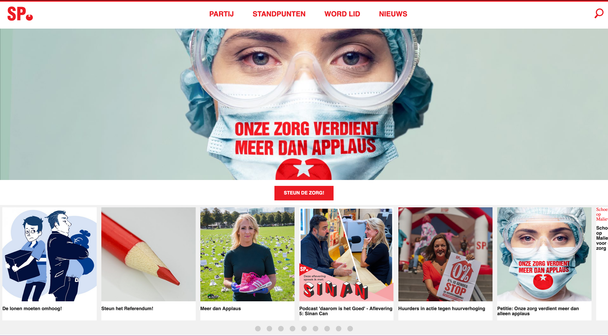
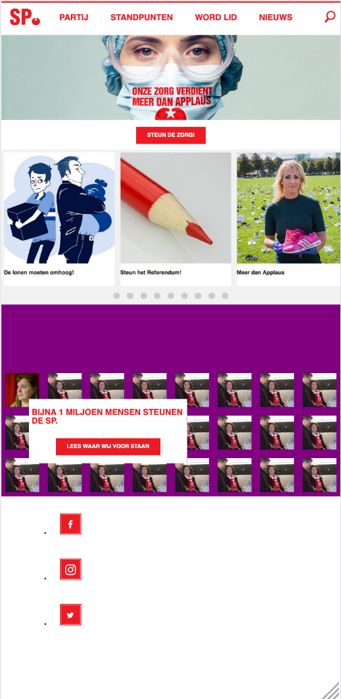
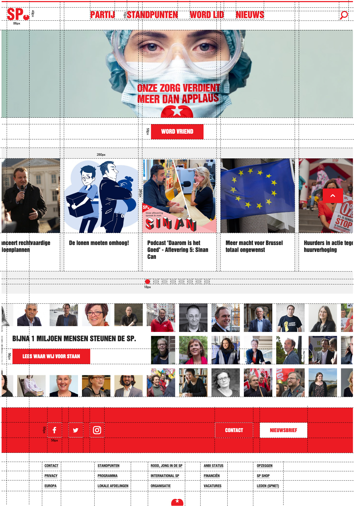

# Procesverslag
**Auteur:** -jouw naam-

Markdown cheat cheet: [Hulp bij het schrijven van Markdown](https://github.com/adam-p/markdown-here/wiki/Markdown-Cheatsheet). Nb. de standaardstructuur en de spartaanse opmaak zijn helemaal prima. Het gaat om de inhoud van je procesverslag. Besteedt de tijd voor pracht en praal aan je website.

## Bronnenlijst
0. https://css-tricks.com/snippets/css/complete-guide-grid/
1. https://css-tricks.com/snippets/css/a-guide-to-flexbox/
2. -bron 2-
3. -...-

## Eindgesprek (week 7/8)

-dit ging goed & dit was lastig-

**Screenshot(s):**

-screenshot(s) van je eindresultaat-

## Voortgang 3 (week 6)

-same as voortgang 1-

## Voortgang 2 (week 5)

-same as voortgang 1-

## Voortgang 1 (week 3)

### Stand van zaken

-dit ging goed & dit was lastig-

Ik vond het erg lastig om de header img goed te plaatsen als het scherm kleiner werd. Het moet in het midden en groter.

Ik moet de carousel nog fixen, maar verwacht niet dat dit al te lastig is.

Ik krijg bij de onderste banner de ruimte niet weg waar de kop eerst stond. Hier moet ik nog over navragen.

Het menu ging erg makkelijk, grid was ook vrij makkelijk toe te passen, buttons stylen ging prima, etc.

**Screenshot(s):**

-screenshot(s) van hoe ver je bent-

### Agenda voor meeting

-samen met je groepje opstellen-

#### Mijn vragen:
1. Hoe plaats ik de banner in het midden?
2. Hoe maak ik een carousel? Linkje?
3. Hoe haal ik die lelijke ruimte boven mn tweede banner weg?

### Verslag van meeting

-na afloop snel uitkomsten vastleggen-

## Intake (week 1)

**Je startniveau:** -kies uit zwart, rood óf blauw-

Mijn startniveau is redelijk middelmatig. Ik heb het vak hiervoor al een keer gevolgd, en ken daarom de basis. maar als het iets ingewikkelder wordt halverwege het blok verlies ik misschien het overzicht. Hierdoor kies ik voor de middelste piste (rood?).

**Je focus:** -kies uit responsive óf surface plane-

Mijn focus tijdens dit vak zal liggen bij responsive. De website die ik wil behandelen, is niet erg bijzonder als het gaat om uiterlijk. Er zijn echter veel kleine details in opgenomen, zodat de website goed vertaald van desktop naar mobiel en de lekker loopt.

**Je opdracht:** -link naar de website die je gaat namaken óf de naam van je eigen ontwerp-

www.sp.nl

**Screenshot(s):**

**Breakdown-schets(en):**

