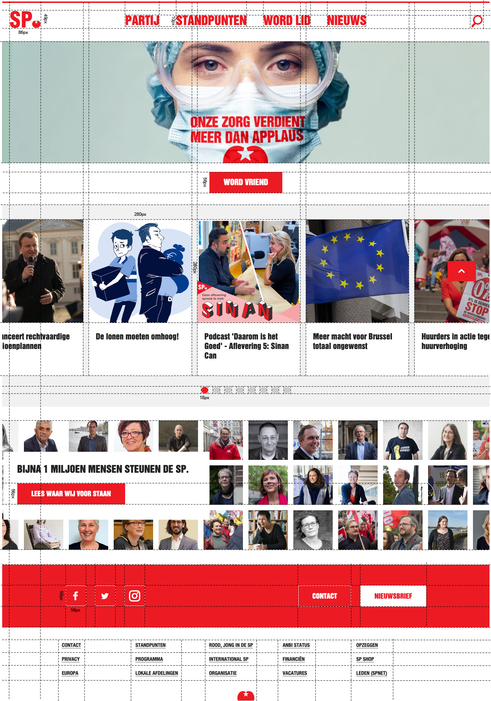

# Procesverslag
**Auteur: Stijn Ramp**

## Hulpbronnenlijst
1. https://zellwk.com/blog/style-hover-focus-active-states/
2. https://developer.mozilla.org/en-US/docs/Learn/Accessibility/HTML
3. https://stackoverflow.com/questions/62435376/media-queries-for-breakpoints-are-effective-only-if-touch-simulation-is-on
4. https://zellwk.com/blog/rem-vs-em/
5. https://stackoverflow.com/questions/9852312/list-of-html5-elements-that-can-be-nested-inside-p-element
6. https://webdesign.tutsplus.com/tutorials/how-to-build-web-form-layouts-with-css-grid--cms-28776
7. https://www.smashingmagazine.com/2017/10/naming-things-css-grid-layout/
8. https://stackoverflow.com/questions/2984311/delete-default-value-of-an-input-text-on-click
9. https://stackoverflow.com/questions/12875911/how-can-i-make-my-input-type-submit-an-image
10. http://www.codecenter.nl/pr/code/html/form_input
11. https://www.w3schools.com/html/html_forms.asp
12. https://iconmonstr.com/twitter-1-svg/ (Ook voor fb en instagram)
13. https://developer.mozilla.org/en-US/docs/Web/API/Window/innerWidth
14. https://developer.mozilla.org/en-US/docs/Web/API/Screen/width
15. https://dmitripavlutin.com/screen-window-page-sizes/#22-the-window-inner-size
16. https://css-tricks.com/video-screencasts/150-hey-designers-know-one-thing-javascript-recommend/
17. https://developer.mozilla.org/en-US/docs/Web/SVG/Tutorial/Fills_and_Strokes
18. https://www.w3schools.com/cssref/css_selectors.asp
19. https://errorsea.com/how-to-change-button-color-on-hover-using-css/
20. https://css-tricks.com/using-svg/
21. https://helpx.adobe.com/uk/illustrator/how-to/export-svg.html
22. https://www.w3schools.com/CSSref/pr_grid-template-areas.asp
23. https://www.w3schools.com/cssref/pr_background-image.asp
24. https://www.freecodecamp.org/news/how-to-center-anything-with-css-align-a-div-text-and-more/
25. https://developer.mozilla.org/en-US/docs/Web/CSS/CSS_Transforms/Using_CSS_transforms
26. https://www.w3schools.com/cssref/sel_nth-child.asp
27. https://css-tricks.com/almanac/properties/t/transition/
28. https://developer.mozilla.org/en-US/docs/Web/CSS/transform-function/translateX
29. https://www.w3schools.com/js/js_array_methods.asp
30. https://speckyboy.com/open-source-carousel-sliders-css/
31. https://www.cssscript.com/touch-enabled-carousel-slider-with-pure-javascript-purejscarousel/
32. https://www.w3schools.com/howto/howto_js_slideshow.asp
33. https://www.youtube.com/watch?v=gBzsE0oieio
34. https://css-tricks.com/almanac/properties/t/transition-timing-function/
35. https://www.w3schools.com/csS/css3_buttons.asp
36. https://dev.to/ljcdev/easy-hamburger-menu-with-js-2do0
37. https://www.w3schools.com/howto/howto_css_sticky_element.asp
38. https://css-tricks.com/snippets/css/a-guide-to-flexbox/
39. Waarschijnlijk een paar vergeten

## Eindgesprek (week 7/8)

## Voortgang 3 (week 6)

### Stand van zaken

Mijn website heeft een flinke inhaalslag gemaakt. Mn grid en carousel kloppen, ik ben gaan experimenteren met states, accesibility en SVG's. De site klopt nu grotendeels, maar ik moet nog wel wat dingen fixen. Zoals mn onderste banner. Waar ik een grid op moet toepassen en moet zorgen dat de tekst over de banner komt op fullscreen. En het hamburgermenu. Dit heb ik al grotendeels uitgevogeld. Ik moet het alleen nog samenvoegen. 

**Screenshot(s):**

### Agenda voor meeting

We hebben het gehad over positionering, hamburgermenu's die van schermgroote veranderen en het stylen van form elementen. 

### Verslag van meeting

Er kwamen wel wat interessante dingen naar boven, maar veel kon ik niet gebruiken / had ik al toegepast. 

## Voortgang 2 (week 5)

### Stand van zaken

Ik probeerde mijn website in een grid te zetten, maar dit mislukte compleet. De hele website ziet er nu niet meer uit. Ik zal dit volgende week oplossen. Ik heb de afgelopen week niet heel veel gedaan en loop een beetje achter. 

**Screenshot(s):**

### Agenda voor meeting

We hebben het gehad over grid, hover, navigation en buttons

### Verslag van meeting

Ik heb meegeluisterd hoe anderen hun carousel hadden gemaakt en hier heb ik inspiratie uit gehaald. Ook werd grid nog een keer voorgedaan. Ik zag in dat ik mn rows een specifieke hoogte had gegeven. Hierdoor paste de content niet op de pagina. 

## Voortgang 1 (week 3)

-dit ging goed & dit was lastig-

Ik ben tevreden met mijn header op desktop niveau. Ik kwam er pas later achter dat wij mobile first moesten werken... De site is niet erg responsive. Slechts enkele onderdelen schalen mee. Ik heb tnt alleen de header gedaan. 

**Screenshot(s):**

-screenshot(s) van hoe ver je bent-

### Agenda voor meeting

-samen met je groepje opstellen-

Ons groepje wil zich focussen op  het toevoegen van tekst en HTML 

### Verslag van meeting

-na afloop snel uitkomsten vastleggen-

SVG afbeeldingen schalen mee en zijn daarom perfect om te gebruiken in menu's en buttons. Carousels werden uitgelegd en het belang van buttons (voor accesibility) werd uitgelegd. 

## Intake (week 1)

**Je startniveau:** -kies uit zwart, rood óf blauw-

Mijn startniveau is redelijk middelmatig. Ik heb het vak hiervoor al een keer gevolgd, en ken daarom de basis. maar als het iets ingewikkelder wordt halverwege het blok verlies ik misschien het overzicht. Hierdoor kies ik voor de middelste piste (rood?).

**Je focus:** -kies uit responsive óf surface plane-

Mijn focus tijdens dit vak zal liggen bij responsive. De website die ik wil behandelen, is niet erg bijzonder als het gaat om uiterlijk. Er zijn echter veel kleine details in opgenomen, zodat de website goed vertaald van desktop naar mobiel en de lekker loopt.

**Je opdracht:** -link naar de website die je gaat namaken óf de naam van je eigen ontwerp-

www.sp.nl

**Screenshot(s):**

**Breakdown-schets(en):**

